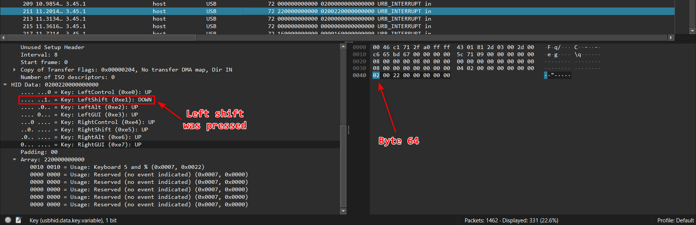

# [Forensics] Ramen lockdown

what do all these words even mean?

The challenge provided a Wireshark log file `log.pcapng` with 2 text files named `flag.txt` and `synoonyms.txt`

Opening the file, we could see mainly packets with the information "URB INTERRUPT" which is an IP packet and a USB endpoint is like an IP port.  
Perhaps hidden under this log file is a message someone entered from the keyboard

# Solution

Apply filter `frame.len == 72` to filter out packets which isn't contain HID data
Parse each filtered packets, follow by these rules

64th byte: Left shift key down / up (pressed or not)
66th byte: Usage key

You can see what key pressed in Wireshark (HID Data > Array)



After parsing, I got a script

```
nvim flag.txt
:%s/0/10101/g
:%s/1/10011/g
:%s/[01]/\=system("awk 'NR % 2 ==".(submatch(0) == "0" ? "0" : "1")."' synoonyms.txt | shuf -n1")/g
```

By using ChatGPT - a really helpful AI, we got a Python script to restore `flag.txt` before the last line ran

```
with open("synoonyms.txt", "r", encoding="utf-8") as f:
    lines = [line.strip() for line in f.read().splitlines()]

even_words = set(lines[1::2])
odd_words = set(lines[0::2])

with open("flag.txt", "r", encoding="utf-8") as f:
    words = f.read().split()

binary_string = "".join("0" if word in even_words else "1" for word in words)

with open("recovered_binary.txt", "w", encoding="utf-8") as f:
    f.write(binary_string)

print("Done! Saved as recovered_binary.txt")
```

Continue using `neovim`, I replaced every `10011` to `1` and every `10101` to `0`

`$ nvim recovered_binary.txt`

and in `neovim`  
```
:%s/10101/0/g
:%s/10011/1/g
```

Open the file `recovered_binary.txt`, copy the binary string inside and [convert to ASCII](https://www.duplichecker.com/binary-to-ascii.php)

Flaggg, finally got the flag!!1

# Flag `apoorvctf{ne0v1m_1s_b3tt3r}`