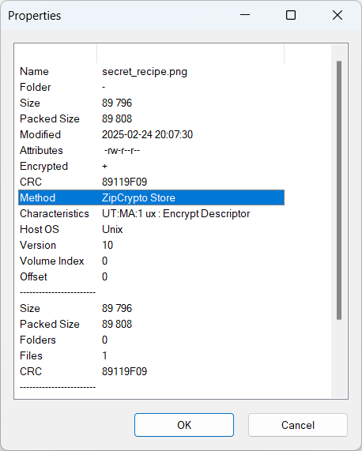

# [Forensics] Ramen lockdown
A criminal mastermind named larry stole Chef Tataka ultimate ramen recipe and yeeted it into a password-protected zip file. Inside? A sacred file with the secret to flavor nirvana. Crack the zip, save the slurp. No pressure. 🍜💀

The challenge provided a compressed file `recipe.zip`

# Analysis
As the challenge description said, we have to crack the `recipe.zip` file. This file requires password for extracting files contained inside it

Normally, compressed files use AES-256 encryption. Therefore, it is very difficult to brute-force passwords.
However, we can directly view the file inside by using 7-Zip. There's a file named `secret_recipe.png`

# Solution

Still using 7-Zip, we know the encryption method is not AES-256! It's ZipCrypto

Nice, we gonna use [bkcrack](https://github.com/kimci86/bkcrack) to extract the `secret_recipe.png` image

To break ZipCrypto, `bkcrack` requires 12 bytes of known plaintext. PNG files start with the following hex header: `89 50 4E 47 0D 0A 1A 0A 00 00 00 0D 49 48 44 52`

I used this command (finished in ~3 minutes)
`bkcrack -C recipe.zip -c secret_recipe.png -x 0 89504E470D0A1A0A0000000D49484452`

And got the key
`7cfefd6a 4aedd214 970c7187`

Now, we can decrypt the archive and save it as an unencrypted version
`bkcrack -C recipe.zip -k 7cfefd6a 4aedd214 970c7187 -D recipe_decrypted.zip`

Opened the image inside `recipe_decrypted.zip`, and I got ...

# Flag: `apoorvctf{w0rst_r4m3n_3v3r_ong}`