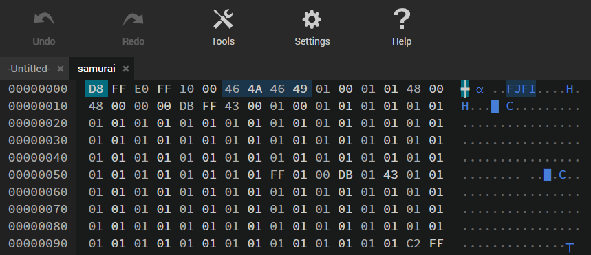

# [Forensics] Samurai's Code

Unveil the lost code of the Samurai and unlock the mystery hidden within.

The challenge provided a compressed file with an `sam.png` image inside

# Analysis

Open the image, I cannot see any information relate to flag, it's just a normal image with samurai.  
Maybe we have to find out any information hidden inside the image

# Solution

By using command `$ strings sam.png`, I got a very suspicious text block at the end.

```
++++++++++[>+>+++>+++++++>++++++++++<<<<-]>>>>++++.++++++++++++..----.+++.<------------.-----------..>---------------.++++++++++++++.---------.+++++++++++++.-----------------.<-.>++.++++++++..--------.+++++.-------.<.>--.++++++++++++.--.<+.>-------.+++.+++.-------.<.>-.<.++.+++++++++++++++++++++++++.+++++++++++++.>+++++++++++++.<+++++++++++++.----------------------------------.++++++++.>+++++++++.-------------------.<+++++++.>+.<-----.+++++++++.------------.<+++++++++++++++.>>++++++++++++++++.<+++.++++++++.>-.<--------.---------.++++++++++++++++++++.>.<++.>--------------.<<+++++.>.>-----.+++++++.<<++.>--.<++.---------.++.>>+++++++++++.-------------.----.++++++++++++++++++.<<++++++++++++++++.>>--.--.---.<<--.>>+++.-----------.-------.+++++++++++++++++.---------.+++++.-------.
```

This is [Brainfuck](https://md5decrypt.net/en/Brainfuck-translator/) language. By decrypting it, I got a download link, got a new file named `samurai` from downloading

Great, got a new file. However, `exiftool` return me `Error: Unknown file type`

Viewed the hex. I saw a section `FJFI` in the header, this could be a `JFIF` file and we have to edit hexadecimal contents of the file given



Usually, the header of `JFIF` file should be `FF D8 FF E0 00 10 4A 46 49 46`. But it seems like every 2 bytes in the file are swapped.

I wrote a simple Python script to swap every 2 bytes back to their original state.

```
with open("samurai", "rb") as file:
    BUF = 2  # Reverse every 2 bytes
    bytes_rev = b""
    bytes_read = bytearray(file.read(BUF))

    while bytes_read:
        bytes_rev += bytes_read[::-1]
        bytes_read = file.read(BUF)

    with open("swap.jfif", "wb") as newfile:
        newfile.write(bytes_rev)
```

The newly received image file clearly shows what we need to find, which is the flag.

# Flag: `apoorvctf{ByT3s_OUT_OF_ORd3R}`