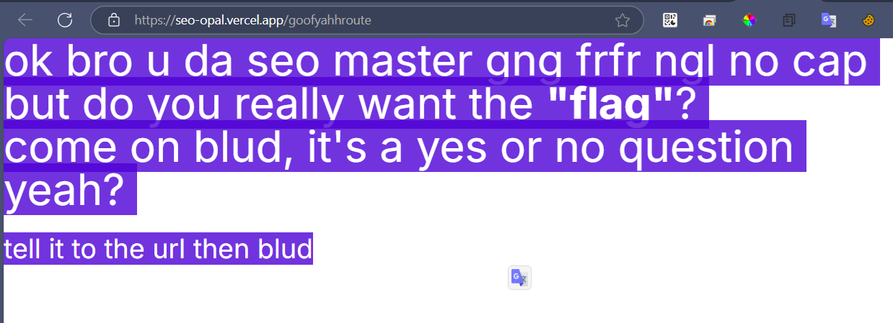

# [Web] SEO CEO
They're optimizing SEO to show this garbage?!
[https://seo-opal.vercel.app](https://seo-opal.vercel.app/)

# Analysis
The description hint a keyword is SEO (search engine optimization). We gonna check out how the SEO works

# Solution
Normally, the SEO search for `sitemap.xml` file.
So that, I tried to get to
https://seo-opal.vercel.app/sitemap.xml

Retrieved the ``sitemap.xml`` content include this block, which is so suspicious route that is ``/goofyahhroute``

```
    <url>
		<loc>https://www.thiswebsite.com/goofyahhroute</loc>
	    <lastmod>2025-02-26</lastmod>
	    <changefreq>never</changefreq>
	    <priority>0.0</priority>
    </url>
```

Open browser, navigate to https://seo-opal.vercel.app/goofyahhroute


By selecting all contents or View source, I could view all the hidden contents
Based on what the route told me, I added a parameter `?flag=yes`

# Flag: `apoorvctf{s30_1snT_0pt1onaL}`